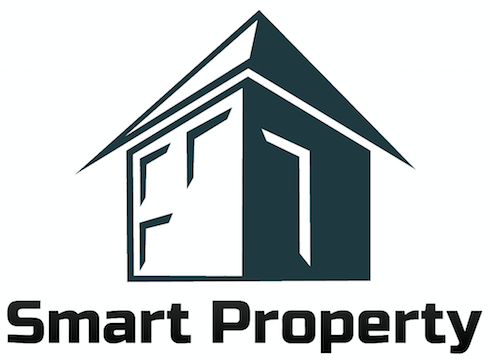
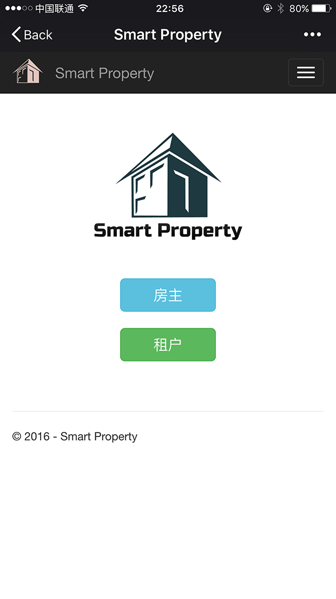
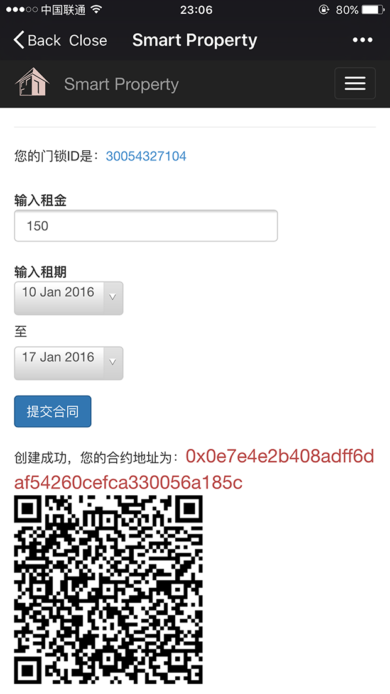
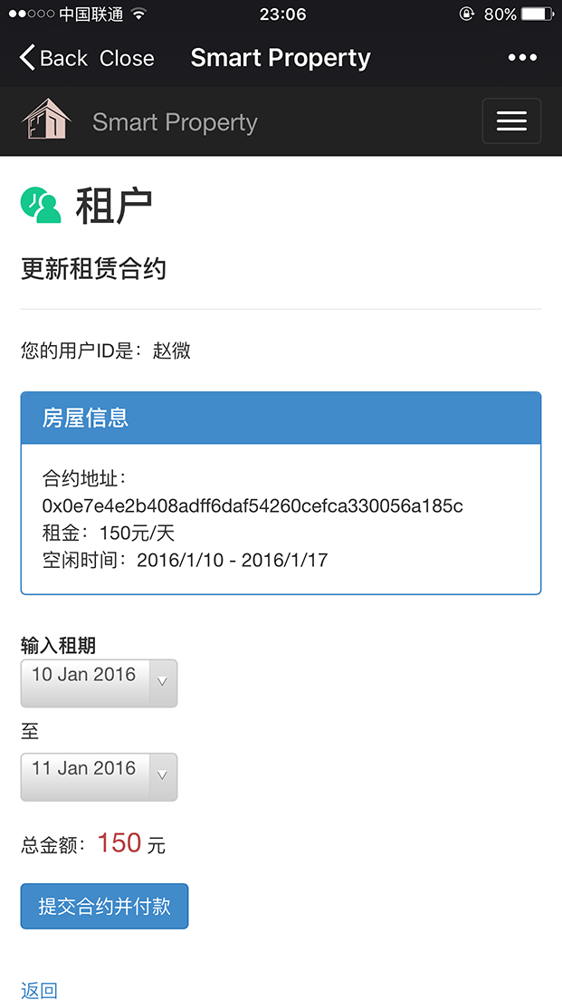

# SmartProperty

这是一个探索智能房产租赁的项目。

房屋所有人可以在区块链上提交一个房屋租赁需求，系统自动生成的智能合约，租户可以申请这个智能合约，提交日期和租金，便能获得租期内该房屋门锁的控制权。这个项目还可以从房屋租赁拓展到车位短期租赁，等各种共享经济类的应用场景。

# 项目成员
本项目临时组队，机缘巧合走到一起，成员主要有：

- [赵微](https://github.com/maxweizhao) Harvey
- [刘志明](https://github.com/jimmysoa) Jimmy
- [陈志同](https://github.com/chenzhitong)
- [徐滕超](https://github.com/zjut019)

感谢[钱友才](https://github.com/tomlion/)大神的大力支持。

# 场景示例

# 应用示例

用户类型选择

房主生成智能合约

租户申请住房合约

2016/01/10
@上海外滩中心
